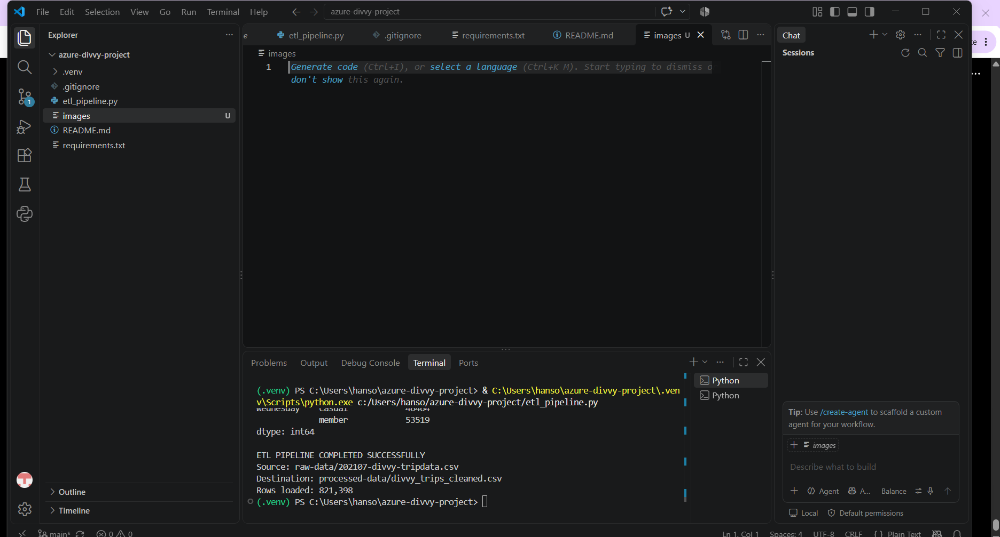

# Azure Divvy Bike-Share ETL Pipeline

## Project Overview

This project demonstrates a cloud-based ETL (Extract, Transform, Load) workflow using Microsoft Azure, Python, and Azure Blob Storage.

The pipeline processes Divvy bike-share trip data stored in Azure Blob Storage, performs data cleaning and transformation with Python and Pandas, and loads the processed dataset back into Azure for downstream analytics.

The completed pipeline processed **821,398 trip records**.

## Architecture

Raw Divvy CSV Data  
↓  
Azure Blob Storage (`raw-data`)  
↓  
Python ETL Pipeline  
↓  
Data Cleaning & Transformation  
↓  
Azure Blob Storage (`processed-data`)  
↓  
Analytics-Ready Dataset

## Technologies Used

- Microsoft Azure
- Azure Blob Storage
- Python
- Pandas
- Azure SDK for Python
- Azure Identity
- Azure CLI
- Visual Studio Code
- Git / GitHub

## ETL Workflow

### 1. Extract

The Python pipeline connects securely to Azure Blob Storage using `DefaultAzureCredential` and reads the raw Divvy trip dataset directly from the `raw-data` location.

### 2. Transform

The pipeline performs several data preparation and feature-engineering operations, including:

- Converting trip timestamps to datetime values
- Calculating trip duration
- Removing zero and negative-duration trips
- Filtering trips longer than 24 hours
- Evaluating missing station and coordinate information
- Removing records with insufficient destination location information
- Creating trip start hour
- Creating day-of-week attributes
- Classifying weekday vs. weekend trips
- Classifying trips into morning, afternoon, evening, and night periods
- Analyzing rider type and trip behavior

### 3. Load

The cleaned dataset is converted back to CSV and uploaded to Azure Blob Storage at:

`processed-data/divvy_trips_cleaned.csv`

Final records loaded:

**821,398**

## Example Analysis

The pipeline also generates analytical summaries including:

- Trips by day of week
- Trips by rider type
- Trips by time of day
- Average trip duration by rider type
- Rider-type activity by day of week

## Project Structure

```text
azure-divvy-project/
│
├── etl_pipeline.py
├── requirements.txt
├── .gitignore
└── README.md

So it should look like:

```text
azure-divvy-project/
│
├── etl_pipeline.py
├── requirements.txt
├── .gitignore
└── README.md
```

## Pipeline Execution

The screenshot below shows the successful execution of the ETL pipeline, processing 821,398 Divvy trip records from Azure Blob Storage.

